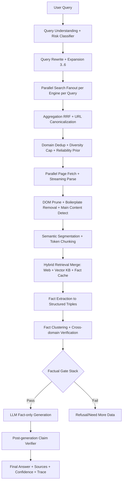

# RFC: RAG Production Redesign (Reliability, Retrieval Quality, Latency, Anti-Hallucination)

**Status:** Draft  
**Date:** 2026-03-12  
**Authors:** AI Systems Audit  
**Scope:** `pipeline_v3`, `retrieval/*`, `processing/*`, `core/fact_*`, CLI/GUI factual execution paths

---

## 1) Executive Summary

Этот RFC формализует единый production-контур для factual RAG в Lina с жёстким инвариантом:

> **LLM не может генерировать factual-контент, если нет верифицированных фактов.**

Ключевые цели:
- повысить recall/precision retrieval без взрыва latency;
- устранить архитектурную фрагментацию между `pipeline_v3` и legacy factual paths;
- усилить верификацию фактов по независимым доменам;
- ввести streaming retrieval/generation для снижения time-to-first-token.

---

## 2) Current-State Audit (Code-Level)

### 2.1 Что уже хорошо
- Есть зрелый multi-stage factual pipeline в `pipeline_v3`.
- Есть multi-query rewrite (`core/query_rewriter.py`) и multi-engine merge (RRF).
- Есть анти-галлюцинационные проверки до и после генерации.
- Есть базовая параллельность (search/download/processing) через `ThreadPoolExecutor`.

### 2.2 Проблемы текущего состояния
1. **Дублированные factual execution paths**:
   - `pipeline_v3`;
   - factual ветки в `core/cli.py` и `gui/app.py`;
   - legacy `core/fact_pipeline.py` рядом с `core/fact_extractor.py` + `core/fact_verifier.py`.

2. **Несимметричный search fanout**:
   - не все движки получают весь набор query variants.

3. **HTML extraction без полноценных block-scoring эвристик**:
   - есть структурная очистка, но нет строгого text-density/link-density pruning.

4. **Fact schema и verification не унифицированы по всем контурам**:
   - несколько `Fact`-моделей/верификационных правил в проекте.

5. **Latency pipeline stage-barrier**:
   - генерация чаще стартует после полного retrieval/verification цикла,
     а не при достижении минимального verified set.

---

## 3) Target High-Level Architecture



---

## 4) Retrieval Redesign

### 4.1 Query generation policy (3–6 queries)
Для каждого factual запроса:
1. primary rewritten query;
2. entity+attribute canonical query;
3. multilingual variant (RU/EN as needed);
4. intent template variant (`specs`, `comparison`, `docs`...);
5. domain-targeted variant (`site:gsmarena.com OR site:notebookcheck.net`);
6. broad fallback variant для второго прохода.

### 4.2 Parallel search policy
- Все активные движки получают 3–6 query variants (с лимитами per-engine).
- Вводится budget-aware fanout: при перегрузе движков уменьшаются low-priority variants, но не primary/canonical.

### 4.3 Aggregation and dedup
- Reciprocal Rank Fusion с engine-agreement bonus.
- URL canonicalization + dedup.
- Per-domain cap (например, `max 2` результата в top-k).
- Diversity penalty для повторяющихся доменов.

### 4.4 Pseudocode

```python
def generate_queries(query):
    qu = classify_query(query)  # intent, entities, attributes, language
    variants = []
    variants.append(rewrite_primary(query, qu))
    variants.append(build_entity_attribute_query(qu))
    variants.extend(build_multilingual_variants(qu))
    variants.extend(build_intent_variants(qu.intent, qu.entities, qu.attributes))
    variants.extend(build_domain_targeted_variants(qu.entities, qu.attributes))
    variants = dedup_preserve_order([v for v in variants if v])
    if len(variants) < 3:
        variants = pad_minimum_variants(variants, query, min_n=3)
    return variants[:6]


def run_parallel_search(queries):
    tasks = []
    for engine in active_engines():
        for q in queries:
            tasks.append((engine, q))
    results = parallel_map(search_once, tasks, timeout=per_engine_timeout())
    return group_results(results)


def merge_and_rank_results(results):
    flat = flatten(results)
    canon = [canonicalize_url(r) for r in flat if is_valid_result(r)]
    fused = reciprocal_rank_fusion(canon, k=60)
    fused = dedup_by_url(fused)
    fused = apply_domain_cap(fused, max_per_domain=2)
    scored = rank_by_signals(
        fused,
        signals=["query_match", "domain_reliability", "freshness", "diversity", "engine_agreement"],
    )
    return scored
```

---

## 5) HTML Parsing and Content Extraction Redesign

### 5.1 Required pipeline
`HTML -> DOM parse -> boilerplate removal -> main content detect -> normalize -> semantic segmentation -> chunks`

### 5.2 Block scoring
Для каждого DOM-блока вычислять:
- `text_density`;
- `link_density`;
- `boilerplate_penalty` (class/id regex);
- `structure_bonus` (`article`, `main`, heading proximity).

Удалять блоки: navigation/sidebar/ad/cookie/comments/related-posts.

### 5.3 Chunking strategy for RAG
- chunk size: 200–400 tokens;
- overlap: 40–80 tokens;
- разрез по paragraph boundaries;
- таблицы/списки сохранять как атомарные semantic blocks.

### 5.4 Pseudocode

```python
def extract_main_content(html):
    dom = parse_dom(html)
    remove_noise_tags(dom, tags=["script", "style", "noscript", "iframe", "svg"])
    blocks = collect_candidate_blocks(dom)

    kept = []
    for block in blocks:
        if is_irrelevant_block(block):
            continue
        score = 0.0
        score += 2.0 * text_density(block)
        score -= 1.5 * link_density(block)
        score -= boilerplate_penalty(block)
        score += structure_bonus(block)
        if score >= MAIN_CONTENT_THRESHOLD:
            kept.append((score, block))

    main = select_top_contiguous_blocks(kept, min_chars=800)
    return normalize_text(join_blocks(main))


def split_into_chunks(text):
    paragraphs = split_by_paragraph(text)
    chunks = []
    current = []
    current_tokens = 0

    for p in paragraphs:
        pt = estimate_tokens(p)
        if current and current_tokens + pt > 400:
            chunks.append(join_paragraphs(current))
            current = tail_with_overlap(current, overlap_tokens=60)
            current_tokens = estimate_tokens(join_paragraphs(current))
        current.append(p)
        current_tokens += pt

    if current:
        chunks.append(join_paragraphs(current))

    return [c for c in chunks if 200 <= estimate_tokens(c) <= 450]
```

---

## 6) Fact Extraction and Verification Redesign

### 6.1 Canonical Fact schema

```python
@dataclass
class FactRecord:
    subject: str
    predicate: str
    object: str
    source_url: str
    domain: str
    confidence_score: float
    evidence_span: str
    extracted_at: float
```

### 6.2 Fact clustering
- cluster key: normalized `(subject, predicate)` + semantic value similarity;
- объединение дублей из разных источников;
- конфликтующие values -> сохранять competing claims с пониженным confidence до разрешения.

### 6.3 Domain reliability scoring
Базовая шкала:
- official docs: `1.0`;
- major knowledge bases: `0.9`;
- dev forums: `0.7`;
- unknown blogs: `0.3`.

Формула (пример):
`fact_conf = base_extract_conf * reliability_weight * consensus_weight * independence_weight`

### 6.4 Verification rules
- подтверждение от `>=2` независимых доменов: confidence up;
- low reliability domains: downweight/filter;
- single-domain factual answers: cap confidence.

---

## 7) Anti-Hallucination Gate Stack

### Layer 1: Retrieval confidence threshold
- отказ/перезапрос, если retrieval confidence ниже порога.

### Layer 2: Minimum fact count
- factual intent требует минимум `N` фактов (например `N>=2`).

### Layer 3: Verified facts check
- factual intent при `verified_facts == 0` -> строгий refusal.

### Layer 4: Prompt restrictions
- generation only from fact context;
- explicit prohibition на external prior knowledge.

### Mandatory invariant pseudocode

```python
if intent == "factual" and verified_facts_count == 0:
    return refusal_response("Недостаточно верифицированных данных")
```

### Post-generation verifier
- выделить claims из ответа (numeric/entity/relation);
- проверить support в `FactRecord` set;
- unsupported claims удалять/помечать;
- если после очистки смысл потерян -> refusal + explain uncertainty.

---

## 8) Latency Optimization Plan

### 8.1 Where latency lives
- search API;
- page downloads;
- HTML parse/clean;
- ranking/embedding;
- fact extraction/verification;
- LLM generation.

### 8.2 Parallel and streaming execution
- search fanout параллельно;
- download+parse запускается сразу по мере получения результатов;
- fact extraction выполняется инкрементально на готовых chunks;
- LLM generation начинается при достижении `min_verified_facts`.

### 8.3 Execution model
- `asyncio` для network I/O + bounded executor для CPU parse/ranking;
- bounded queues между стадиями;
- cancellation при достижении достаточной уверенности.

---

## 9) Hybrid Retrieval (Web + Vector KB + Fact Cache)

### 9.1 RetrievalBroker policy
Порядок:
1. `FactCache` lookup;
2. `VectorKB` lookup;
3. `WebSearch` only if confidence still below threshold.

### 9.2 Cache policy
- store verified fact clusters c TTL;
- invalidate by staleness rules for volatile intents (price/news/release);
- attach provenance and timestamps to every cache hit.

---

## 10) Architecture Simplification

### 10.1 Remove duplicated factual logic
- factual execution должен идти через один production path (`pipeline_v3`-family);
- CLI/GUI factual branches -> thin adapters to unified pipeline;
- legacy `core/fact_pipeline.py` перевести в compatibility mode, затем deprecate.

### 10.2 Single source of truth contracts
- один Fact schema;
- один verifier policy;
- один generation gate policy;
- один domain reliability registry.

---

## 11) Interface Contracts (Implementation-Ready)

```python
from dataclasses import dataclass
from typing import Protocol, Sequence

@dataclass
class RetrievalCandidate:
    title: str
    url: str
    snippet: str
    score: float
    domain: str
    engine: str

@dataclass
class RetrievalBundle:
    candidates: list[RetrievalCandidate]
    retrieval_confidence: float

@dataclass
class VerificationResult:
    verified_facts: list[FactRecord]
    rejected_facts: list[FactRecord]
    confidence: float

class IRetrievalBroker(Protocol):
    def retrieve(self, query: str, intent: str) -> RetrievalBundle: ...

class IFactVerifier(Protocol):
    def verify(self, facts: Sequence[FactRecord], intent: str) -> VerificationResult: ...

class IGenerationGate(Protocol):
    def allow_generation(self, intent: str, verification: VerificationResult) -> bool: ...
    def refusal(self, intent: str, reason: str) -> str: ...
```

---

## 12) Prioritized Improvement List

### P0 (Safety-critical)
1. Единый factual gate invariant во всех entry points.
2. Запрет fallback generation для factual intents без verified facts.
3. Unified post-generation claim verification.

### P1 (Quality-critical)
4. Полный 3–6 query multi-engine fanout.
5. Domain dedup + diversity cap + reliability-weighted ranking.
6. Canonical Fact schema + independent-domain verification.

### P2 (Latency-critical)
7. Streaming retrieval/fact pipeline + early generation.
8. Async orchestration with bounded concurrency and cancellation.

### P3 (Maintainability)
9. Де-дубликация legacy factual pipelines.
10. Unified metrics and tracing for retrieval/verification/gates.

---

## 13) Safe Migration Plan (PR-by-PR)

### PR-1: Gate Unification (No behavior expansion)
- Introduce `IGenerationGate` and central policy module.
- Route CLI/GUI factual outputs through unified gate.
- Add invariant tests: factual + zero verified facts => refusal.

### PR-2: Canonical Fact Model + Reliability Registry
- Add `FactRecord` + adapters from existing `Fact` types.
- Introduce domain reliability registry and weighted confidence.
- Keep old model behind adapter for backward compatibility.

### PR-3: Retrieval Fanout Upgrade
- Update parallel search to full query fanout across engines.
- Add per-domain cap + engine-agreement scoring.
- Add telemetry: recall@k proxy, dedup ratio, engine coverage.

### PR-4: HTML Block Scoring + Chunking Upgrade
- Add block scoring extractor.
- Switch chunker to token-based 200–400 with 40–80 overlap.
- Add regression tests for noisy pages and table-heavy pages.

### PR-5: Streaming Pipeline
- Introduce staged queues and incremental verification.
- Start generation on `min_verified_facts` event.
- Add cancellation and timeout budgets.

### PR-6: Deprecation and Cleanup
- Mark legacy factual paths deprecated.
- Remove duplicated logic after parity validation.
- Update docs/runbooks.

### Rollout
- Shadow mode (old vs new in parallel metrics-only).
- Canary 10% -> 50% -> 100%.
- Auto-rollback on SLO breaches.

---

## 14) SLOs, Metrics, and Risk Controls

### Core SLOs
- factual unsupported-claim rate <= 1.0%;
- refusal precision for insufficient evidence >= 98%;
- retrieval p95 <= 2.5s (without generation);
- end-to-end factual p95 <= 6.0s (local profile dependent).

### Required metrics
- queries_generated_count;
- engine_fanout_coverage;
- dedup_ratio;
- verified_fact_count;
- independent_domain_count;
- gate_refusal_rate;
- postgen_claims_removed_count;
- stage_latency_ms (per stage, p50/p95).

### Risks and mitigations
- **Over-refusal risk** -> calibrate thresholds by intent class.
- **Latency inflation from fanout** -> budget-aware fanout + cancellation.
- **Domain poisoning** -> reliability registry + manual denylist/allowlist.

---

## 15) Definition of Done

Считается завершённым, когда:
1. factual generation невозможна при `verified_facts == 0` во всех entry points;
2. retrieval использует 3–6 queries и multi-engine fanout;
3. fact verification учитывает независимость доменов и reliability scoring;
4. post-generation verifier удаляет unsupported claims;
5. latency SLO подтверждён на canary;
6. legacy duplicated factual logic выведен из критического пути.

---

## 16) Immediate Next Actions (Implementation Start)

1. Создать модуль `lina/pipeline/generation_gate.py` с `IGenerationGate` + policy.
2. Подключить gate в `pipeline_v3`, `core/cli.py`, `gui/app.py` factual branches.
3. Добавить контрактные тесты на инварианты anti-hallucination.
4. Подготовить PR-2 (canonical fact adapters + domain registry).
